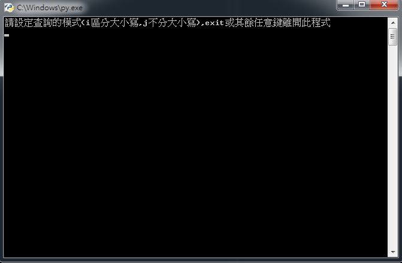
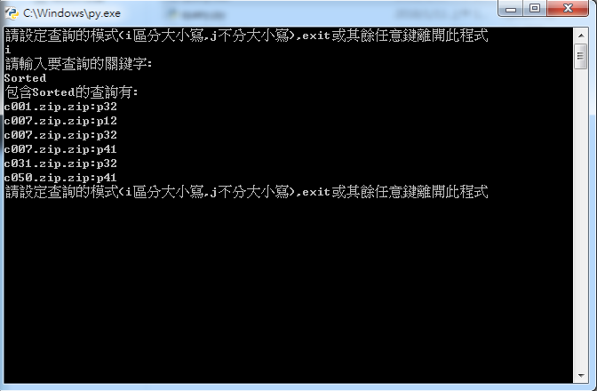
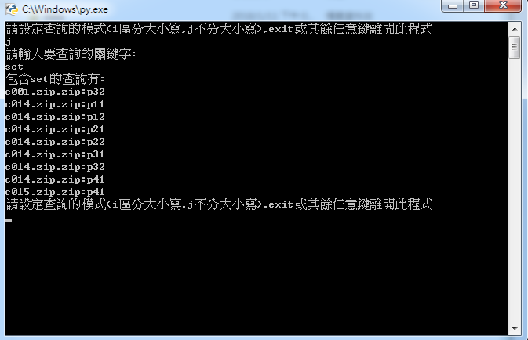
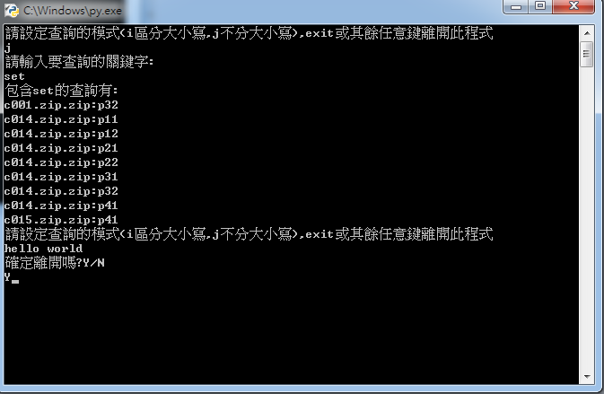

# 查詢全國技藝競賽106程式設計關鍵字
## 使用方式：
* ### 必須先安裝Python，開發這個程式使用的版本為3.4.3，並將python加入環境變數。
* ### 將data資料夾中的data.7z解壓縮
* ### 執行query.bat
## 執行後如圖:

## 區分大小寫的查詢

### 查詢中 前面c0xx，xx是選手編號，冒號之後pxx是題目，如p11是Problem1的第一題、而p32則是Problem3的第二題。依此類推
## 不分大小寫的查詢

## 輸入其他指令將會離開程式

## 但如果是直接輸入exit則不會再做確認，而是直接離開程式。