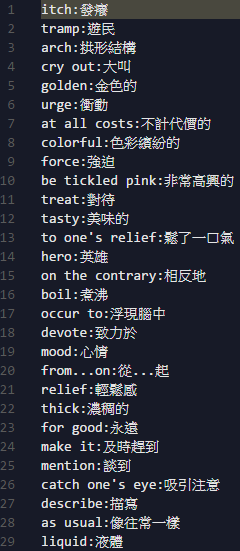
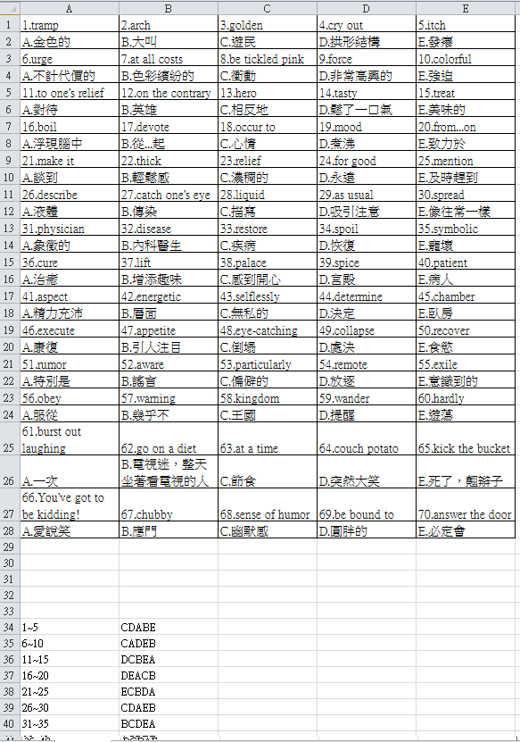

# 產生英文單字練習試卷
## 執行方式
* ## 安裝python點選.py檔案執行
* ## 解壓縮dist.7z，裡面包含編譯過的檔案，可直接執行。
## 使用到以下模組
* ## xlsxwriter
* ## os
* ## random (將題目打亂)
## 使用方式
### 需要自己定義練習的單字，在word.txt文字檔中，格式必須為 `英文:中文`，如下圖

### 執行後會自動將產生出來的文件送至印表機(必須開機)列印。
### 安裝python執行的人也可以把程式最後一行的`os.remove('./result.xlsx')`註解或刪除，這樣就可以保留產生出來的文件，如下圖，每次產生出來的順序答案都不一樣。

## 最佳列印紙張大小為A4。