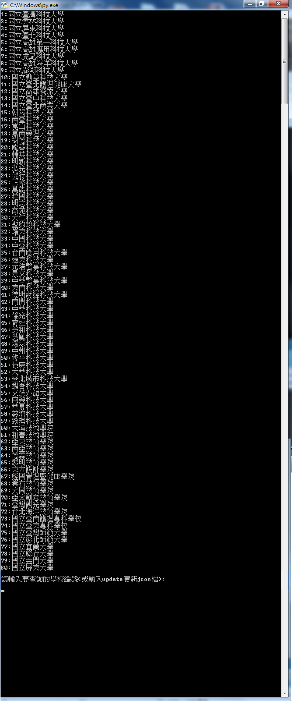
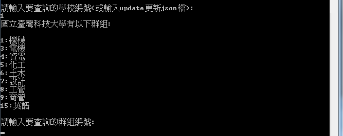
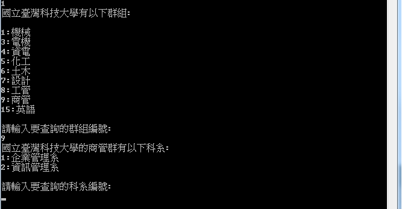

# 106年(2017)大學科技大學四技二專-榜單查詢
## 網址:https://www.com.tw/techreg/
## 操作步驟
* ### 必須先安裝Python，開發這個程式使用的版本為3.4.3，並將python加入環境變數。
* ### 執行score.bat
## 執行畫面

### 輸入學校的編號後會出現這所學校收的群科

### 再來輸入科系的代號

## 執行結果

### 按下任意鍵後，會回到初始畫面，可進行下一次的查詢。
## 程式錯誤畫面:

### 按下任意鍵後，一樣會回到初始畫面，出現原因是輸入的編號不再清單中。